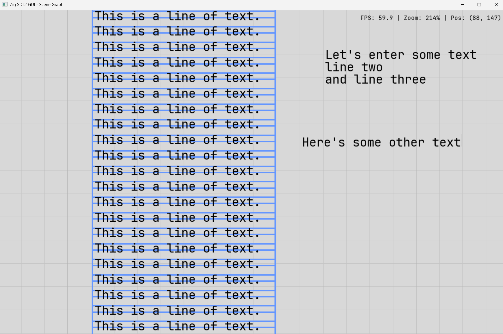

# zig_sdl_gui

A Zig application using SDL2 and SDL2_ttf featuring an infinite scrollable canvas with scene graph architecture, camera controls, and intelligent text caching.



## Prerequisites

### Option A: Linux / Windows WSL

#### Install Zig 0.15.2

```bash
cd ~
wget https://ziglang.org/download/0.15.2/zig-x86_64-linux-0.15.2.tar.xz
tar -xf zig-x86_64-linux-0.15.2.tar.xz
mv zig-x86_64-linux-0.15.2 ~/.local/zig
echo 'export PATH="$HOME/.local/zig:$PATH"' >> ~/.bashrc
source ~/.bashrc
rm zig-x86_64-linux-0.15.2.tar.xz
```

#### Install SDL2 and SDL2_ttf

```bash
sudo apt update
sudo apt install libsdl2-dev libsdl2-ttf-dev
```

### Option B: macOS

#### Install Zig 0.15.2

```bash
brew install zig
```

Or download from https://ziglang.org/download/ and add to PATH.

#### Install SDL2 and SDL2_ttf

```bash
brew install sdl2 sdl2_ttf
```

### Option C: Native Windows

#### Install Zig 0.15.2

1. Download `zig-windows-x86_64-0.15.2.zip` from https://ziglang.org/download/
2. Extract to a directory (e.g., `C:\zig`)
3. Add to PATH: Settings > System > About > Advanced system settings > Environment Variables > Edit PATH

SDL2 and SDL2_ttf libraries are already bundled in `libs/`.

## Building and Running

### Linux / WSL

From the `zig_sdl_gui` directory:

```bash
ZIG_LOCAL_CACHE_DIR=/tmp/zig-cache zig build run
```

The cache variable is needed when building from the Windows filesystem (`/mnt/c/...`) to avoid permission issues.

For a release build:

```bash
ZIG_LOCAL_CACHE_DIR=/tmp/zig-cache zig build -Doptimize=ReleaseFast
```

### macOS

From the project directory:

```bash
zig build run
```

For a release build:

```bash
zig build -Doptimize=ReleaseFast
```

### Native Windows

From Command Prompt or PowerShell in the project directory:

```
zig build run
```

For a release build:

```
zig build -Doptimize=ReleaseFast
```

The executable will be in `zig-out\bin\`. Required DLLs are automatically copied there during build.

## Testing

The project includes comprehensive unit tests using Zig's built-in testing framework (55 tests covering math primitives, camera system, and scene graph).

### Linux / WSL

```bash
ZIG_LOCAL_CACHE_DIR=/tmp/zig-cache zig build test
```

### macOS

```bash
zig build test
```

### Native Windows

```
zig build test
```

**Test Coverage:**
- **Math module** (26 tests): Vec2 operations, Transform, Mat2x3 matrix math
- **Camera module** (17 tests): Coordinate conversions, pan/zoom, Y-axis flipping
- **Scene graph** (18 tests): Element management, text labels, rectangles, memory allocation, visibility

## Controls

### Input Bindings

| Action | Input Binding |
|--------|--------------|
| Pan canvas | Left mouse button drag |
| Zoom in at cursor | Mouse wheel up |
| Zoom out at cursor | Mouse wheel down |
| Quit application | `Escape` key or window close button |
| Resize window | Drag window edges/corners |

### Details

- **Panning**: Click and drag with the left mouse button to move around the infinite canvas
- **Zooming**: Scroll the mouse wheel to zoom in/out. The zoom is centered on the cursor position, keeping the point under your cursor fixed during the zoom
  - Mouse wheel up: Zoom in by 10%
  - Mouse wheel down: Zoom out by 10%
  - **Zoom range**: 25% to 400%
- **Resizing**: Window is resizable; status line anchors to the right edge of the window

### All User Actions

The application supports the following actions (bindings may be customizable in the future):

1. **Quit Application** - Exit the application (bound to Escape key or window close)
2. **Pan Canvas** - Move the camera view around the canvas (bound to left-click drag)
3. **Zoom In at Cursor** - Zoom in centered on cursor position (bound to mouse wheel up)
4. **Zoom Out at Cursor** - Zoom out centered on cursor position (bound to mouse wheel down)
5. **Resize Window** - Change window dimensions (bound to window edge/corner drag)

## Features

**Scene Graph Architecture**

The application demonstrates a modular scene graph system:

- **Coordinate Spaces**: Elements can be in world space (affected by camera pan/zoom) or screen space (fixed UI like the FPS counter)
- **Camera System**: World/screen coordinate conversion with Y-axis flipping for proper world-space orientation
- **Transform System**: Position, rotation, and scale primitives with matrix support
- **Input Handling**: Mouse tracking with drag detection (3-pixel threshold) and cursor-centered zooming
- **Rendering Elements**: Text labels with caching, rectangles with configurable border thickness

**Rendering Features**

Text rendering with caching:
- Text is rasterized to a texture and cached per element
- Zooming out scales the cached texture down (fast, good quality)
- Zooming in re-rasterizes when the target size exceeds 110% of the cached size
- Avoids pixelation from upscaling while minimizing expensive font rasterization

Rectangle drawing:
- Unfilled rectangular outlines with configurable border thickness
- Border thickness scales with camera zoom for world-space elements
- Positioned using font metrics for precise text borders
- Light blue borders frame each text label with padding

**Module Structure**

- `math.zig`: Vec2, Transform, Mat2x3 math primitives
- `camera.zig`: Camera with pan/zoom and coordinate transformations
- `scene.zig`: Scene graph managing elements with transforms
- `input.zig`: Mouse/keyboard input handling
- `text_cache.zig`: Optimized text rendering cache
- `main.zig`: Application orchestration

The status bar shows current FPS, zoom level, and camera position in world coordinates.

## Display Setup (WSL only)

For the GUI window to appear in WSL, you need one of:

- **WSLg** (built into Windows 11) - should work automatically
- **X server** (VcXsrv, X410, etc.) - set `DISPLAY` environment variable

To verify WSLg is working:

```bash
echo $DISPLAY
```

Should show something like `:0` or `:0.0`.
